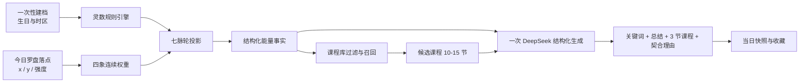

# HAF 当日能量洞察与课程推荐引擎规划

版本：1.0（Demo 实施基线）  
日期：2026-08-23  
状态：确定性 Demo 已实现；真实课程、收藏和生产数据库待接入

## 0. v3 当前实现摘要

- 已实现 `haf-numerology`、`haf-chakra-energy`、`haf-energy-synthesis`、`haf-course-recommendation` 四个项目 Skill。
- H5 运行时已经使用相同的数字、脉轮、关键词与课程标签数据。
- DeepSeek 已用于每日问候和结算页能量解读，不参与计算事实。
- 当前课程理由仍为确定性模板；一次生成三条 AI 理由的生产方案尚未接入。
- 当前课程目录为 15 节 Demo；收藏和用户资料为 localStorage。
- 问候和解读在 Loading 阶段请求，前端 6 秒超时并锁定本地兜底，结果页不再二次跳字。
- 当前数据看板只回答访问用户、收藏用户和收藏总量，不承担算法评估。

## 1. 这套系统要完成什么

把用户的两类信息合并成一次可解释、可收藏、可反复体验的当日探索：

1. 由生日与当天日期得到相对稳定的生命灵数基线和当日数字节律。
2. 由用户在四象罗盘上亲手落下的光点，捕捉此刻的自我感知。
3. 将两者投影为七脉轮的“可用能量与关注方向”，形成当日关键词和简短总结。
4. 从课程库中先筛选、再排序，返回三节不同但都契合当下状态的课程。
5. 解释每节课“为什么适合今天的你”，允许用户收藏，不制造购买压力。
6. 在新的自然日再次感应；历史当日快照与回看能力留待正式数据层。

这不是医学、心理诊断或对命运的确定性预测。灵数与脉轮在产品中应被定义为帮助用户自我反思的象征性框架；罗盘记录的是用户当下的主观感受。

## 2. 推荐的总策略

结论：不要每一步都调用 API，也不要把整套业务逻辑只写成 Agent Skill。采用三层混合架构。

| 层 | 负责什么 | 是否调用模型 | 原因 |
| --- | --- | --- | --- |
| 确定性规则层 | 灵数计算、罗盘权重、脉轮投影、课程硬过滤与基础打分 | 否 | 必须可复算、可测试、可解释、离线可用 |
| 内容智能层 | 把结构化事实写成温柔总结；对候选课程重排；生成契合理由 | 通常一次 | 适合处理语言和语义，不让模型决定基础事实 |
| 产品编排层 | 建档、每日感应、缓存、回退、保存、收藏、埋点 | 否 | 保证流程稳定，控制隐私、成本和延迟 |

当前回访会为每日问候发起一次请求，每次罗盘感应会为能量解读发起一次请求。每个请求独立 6 秒超时；若失败，使用规则层文案继续完成流程。真实课程接入后，应评估把能量总结与三条推荐理由合并为一次结算请求。



## 3. 生产模块划分

### 3.1 NumerologyEngine：灵数规则引擎

输入：

- 出生日期
- 当前日期
- 用户时区
- 规则版本

输出：

- 生命路径数 `life_path`
- 当日个人数字 `personal_day`
- 中间计算过程 `calculation_trace`
- `numerology_rule_version`

产品决策：

- 生日用于长期基线；生日与当天日期用于当日节律。
- 是否保留 11、22、33 等主数字，必须先形成书面规则，不能由模型临时决定。
- 常见生命路径数计算本身不需要性别、出生时间和地点。若未来确实引入这些信息，应另立一个明确命名的解释体系，不要混称为生命灵数。
- 第一版不采集无用信息。出生时间、性别、精确地点先不进入必填项。

### 3.2 CompassEnergyEngine：四象罗盘引擎

推荐把现在的四个方向收敛成真正的二维连续坐标，而不是四选一：

- 左：向内求索
- 右：向外连接
- 上：安静整合
- 下：唤醒行动

罗盘保存归一化坐标 `x ∈ [-1, 1]`、`y ∈ [-1, 1]`。由坐标得到四个权重：

```text
inward  = max(0, -x)
outward = max(0,  x)
calm    = max(0, -y)
active  = max(0,  y)
intensity = min(1, sqrt(x² + y²))
```

四个方向需要归一化。中心点不表示“没有能量”，而表示相对平衡、尚未倾向或用户暂时不确定。结果还应保存手势停留时间与最终确认状态，用于判断输入可信度，但不应偷偷把滑动速度解释为人格。

### 3.3 ChakraProjectionEngine：七脉轮投影引擎

这里不是把四个方向硬分给四个脉轮，而是让每个罗盘位置对七个脉轮产生不同强度的连续贡献，再与数字基线和当日节律合成。

建议的第一版语义矩阵：

| 脉轮 | 罗盘倾向 | 产品中的解释语言 |
| --- | --- | --- |
| 海底轮 | 安静整合 + 适度行动 | 安定、落地、安全感、身体支持 |
| 生殖轮 | 唤醒行动 + 向外连接 | 流动、感受、创造、关系中的愉悦 |
| 太阳神经丛 | 唤醒行动 + 向外连接 | 边界、选择、意志、执行 |
| 心轮 | 内外之间的桥梁，靠近中心或两侧平衡 | 接纳、连接、给予与接收 |
| 喉轮 | 向外连接 + 安静清晰 | 表达、倾听、说出真实感受 |
| 眉心轮 | 向内求索 + 安静整合 | 洞察、辨识、直觉、看见模式 |
| 顶轮 | 向内求索 + 安静整合，低行动倾向 | 意义、空间、放下、整体感 |

生殖轮和太阳神经丛不能只靠同一个坐标区分：前者偏流动、情绪与创造，后者偏目标、边界与决断。第一版可由灵数基线和当日节律辅助区分；若试用中仍经常含混，再增加一个很轻的“能量质地”选择，而不是恢复一长串问卷。

第一版合成权重作为可验证假设，而非永恒真理：

```text
chakra_score =
  35% × numerology_baseline
  + 45% × compass_projection
  + 20% × daily_rhythm
```

所有权重必须配置化并带 `chakra_model_version`。上线前由脉轮领域顾问复核，并用用户反馈校准。

输出：

- 七个 `0-100` 的相对分值
- 一个主要脉轮和一个次要脉轮
- 当前可用能量、需要关照的方向
- 支撑结论的结构化证据 ID

文案避免“堵塞、失衡、治疗”等诊断式表达，优先使用“此刻更活跃”“今天可以多关照”“正在收回力量”。

### 3.4 EnergySynthesisEngine：能量总结引擎

规则层先生成不可篡改的事实包：

```json
{
  "numerology": {"life_path": 9, "personal_day": 6},
  "compass": {"inward": 0.72, "calm": 0.64, "intensity": 0.81},
  "chakras": {"primary": "heart", "secondary": "third_eye"},
  "keyword_candidates": ["放下", "听见", "回到内在"],
  "evidence_ids": ["DAY_9_COMPLETION", "INWARD_HIGH", "HEART_PRIMARY"]
}
```

模型只把这些事实转写为：

- 一个 2-4 字关键词
- 一段 45-75 字的今日能量总结
- 一段 25-45 字的脉轮提示
- 三条基于课程元数据的契合理由

模型不得新增疾病、创伤、因果、前世、确定性未来或规则层不存在的用户事实。

### 3.5 CourseRecommendationEngine：课程推荐引擎

课程库最少需要以下字段：

| 字段 | 用途 |
| --- | --- |
| `course_id` | 稳定标识 |
| `title` / `short_description` / `learning_outcomes` | 语义检索与展示 |
| `status` / `availability` | 过滤不可用课程 |
| `format` / `duration_min` / `difficulty` | 匹配当下可投入程度 |
| `chakra_tags[]` | 脉轮契合 |
| `energy_poles[]` | 内/外、静/动契合 |
| `intention_tags[]` / `keyword_tags[]` | 意图与关键词契合 |
| `intensity` | 避免在低能量时推荐过强练习 |
| `safety_note` / `contraindications` | 安全过滤 |
| `cover_asset` | 课程卡片小图 |
| `embedding` | 从标题、描述和学习结果生成的语义向量 |
| `content_version` | 可追溯与回滚 |

推荐流程：

1. 硬过滤：已发布、当前可用、符合用户限制。
2. 标签匹配与向量召回，得到 10-15 节候选课。
3. 基础分建议：脉轮 35%、罗盘方向 25%、关键词/意图 20%、时长形式 10%、新鲜度与多样性 10%。
4. 把候选课和能量事实一次性送给 DeepSeek 做重排与契合理由。
5. 返回三节，强制覆盖不同练习形式或能量强度，避免三节内容近似。
6. 所有“为什么推荐”必须能追溯到课程标签或描述，不能由模型编造课程功效。

向量检索负责“找得全”，规则和模型重排负责“排得准”；课程编辑标签仍是内容真相源。

### 3.6 DailyJourneyOrchestrator：每日旅程编排器

负责：

- 判断是否首次建档
- 请求并保存罗盘结果
- 串联五个引擎
- 生成输入签名并读取缓存
- 调用模型、校验 JSON、失败回退
- 保存当日快照、推荐结果、收藏状态和版本号
- 记录匿名质量指标与错误追踪

## 4. DeepSeek 的正确使用方式

H5 或小程序绝不能直接调用 DeepSeek。正确链路是：

```text
小程序内嵌 H5 → HAF 后端 → 规则/课程服务 → DeepSeek API
```

推荐一次请求返回严格结构化结果：

```json
{
  "keyword": "放下",
  "energy_summary": "...",
  "chakra_summary": "...",
  "course_ranking": [
    {
      "course_id": "course_001",
      "fit_reason": "...",
      "evidence_tags": ["heart", "inward", "emotion_awareness"]
    }
  ],
  "disclaimer": "这是一份用于自我觉察的当日提示。"
}
```

实现要求：

- 使用结构化 JSON 输出并在服务端做二次 Schema 校验。
- 温度保持低，以减少同一输入的漂移。
- 设置超时、一次有限重试和模板回退；不得无限重试。
- 以“匿名输入摘要 + 日期 + 各规则版本 + 课程库版本”作为缓存键。
- 记录模型名、提示词版本、延迟、消耗与失败原因，不记录完整生日或原始隐私字段。
- 模型只看到完成任务所需的最少信息，不传用户姓名、手机号、精确地点。

## 5. Skill 应该怎么做

这里需要区分两种“Skill”：

### 5.1 生产系统能力

生产系统应是上面六个可测试模块或服务，而不是若干 `SKILL.md`。这样计算规则可版本化、可做单元测试，也能被 H5、小程序后台和运营工具共同调用。

### 5.2 内部 Agent Skills

项目内已经建立前三个基础 Skill，后续再补课程推荐与总编排：

1. `skills/haf-numerology`：调用同一套规则脚本，生成可核对计算轨迹。已完成 v1。
2. `skills/haf-chakra-energy`：使用共享映射矩阵生成七脉轮相对信号。已完成 v0.1。
3. `skills/haf-energy-synthesis`：合并数字、罗盘与主次脉轮，生成关键词和离线可用总结。已完成 v1。
4. `skills/haf-course-recommendation`：从标准课程目录中筛选三节多样化课程并给出证据；已完成 Demo v1，包含 15 节占位课程，待真实课程 API 替换数据适配层。
5. `run-daily-energy-journey`：编排以上能力用于 QA、内容预览和批量测试。待后端接入阶段创建。

Skill 只引用共享规则、Schema 和测试数据，不能复制另一套公式，以免产品与 Agent 得出不同结果。

## 6. 数据与存储

建议实体：

- `UserProfile`：出生日期、时区、授权状态；尽量不保存多余身份信息。
- `DailyEnergyInput`：日期、罗盘坐标、确认时间。
- `NumerologySnapshot`：数字结果、计算轨迹、规则版本。
- `CompassSnapshot`：坐标、四象权重、强度。
- `ChakraSnapshot`：七个分值、主次脉轮、模型版本。
- `EnergyInsight`：关键词、总结、证据 ID、提示词/模型版本。
- `Course`：课程目录与内容版本。
- `RecommendationSnapshot`：候选、最终三节、分数和理由。
- `Favorite`：用户、课程、收藏时间、来源日期。

所有当日结果都保存产生它的版本号：

```text
numerology_rule_version
chakra_model_version
prompt_version
course_catalog_version
recommendation_rule_version
```

这样规则更新后可以解释“为什么同一天旧结果与新结果不同”，也能做灰度与回滚。

## 7. 隐私、安全与表达边界

- 本次对话中已经暴露的 API 密钥必须立即在控制台吊销并重新生成；不要再把新密钥发在聊天、代码或截图中。
- 新密钥只保存在服务端密钥管理或环境变量中，不进入 Git、前端包、日志、埋点或课程数据库。
- 生日属于敏感个人信息：首次收集时说明用途、保存范围、删除方式；提供“仅本次使用”或删除档案能力。
- 除非算法确有明确用途，不采集性别、精确出生时间和精确地点。
- 如果未来确需位置，优先使用时区或城市级信息，不存 GPS 坐标。
- 不宣称预测疾病、疗效、心理状态或确定未来；危机、医疗或心理健康内容不能由课程推荐替代专业帮助。

建议的首次说明：

> 你的生日只用于生成这段探索的数字节律。我们会把它安静地留在你的档案里，你也可以随时清除。这里呈现的是一面用于觉察的镜子，而不是对你的定义。

## 8. 七脉轮如何在界面上显化

第一版不需要再增加复杂问卷，可在罗盘确认后的 1-1.5 秒结算动画中显化：

1. 用户确认光点，四个方向的细线依照权重亮起。
2. 一条无硬边界的光流从罗盘点延伸到纵向七个脉轮光点。
3. 七个点以 `0-100` 相对强度改变光晕大小与亮度，不使用红色报警。
4. 主脉轮完整显色，次脉轮轻亮，其余保持呼吸般微光。
5. 结果页显示“灵数 · 主脉轮 · 方向”，下一行增加一句可读的总结。
6. 点击脉轮名称可展开“为什么今天出现这个提示”，展示两到三条证据，而不是神秘黑盒。

不要写“检测到脉轮堵塞”。建议写：

- “今天，心轮的感受更靠近你。”
- “向内与安静的倾向，让眉心轮成为第二条线索。”
- “这不是定论，你可以把它当成一次对自己的轻轻询问。”

## 9. 质量验证与验收指标

### 9.1 规则质量

- 20 个以上灵数黄金样例，人工逐步核算。
- 罗盘中心、四极、四象限和边界点测试。
- 相同输入与版本必须得到完全相同的结构化结果。
- 30-50 个由领域顾问编写的“罗盘 + 数字 → 脉轮”案例。

### 9.2 推荐质量

- 至少 30 节带完整标签的 Demo 课程后再判断推荐效果。
- 100 组离线推荐案例，人工评分：相关性、理由真实性、多样性、语气。
- 即使关闭 DeepSeek，也必须能给出合理的三个结果。
- 模型只能选择候选集中的课程 ID，所有理由必须通过证据标签校验。

### 9.3 产品指标

- 首次建档完成率
- 罗盘确认率
- 结果页读完率
- 三张课程卡片滑动率与收藏率
- 7 日内再次感应率
- 收藏后课程开始率
- API 成功率、P95 延迟、缓存命中率、单次成本

## 10. 分阶段实施计划

### Sprint 0：规则与产品契约（1 周）

目标：在写业务代码前把“怎么算、怎么说、不能说什么”确定下来。

- 确认生命路径数、个人日数字与主数字规则。
- 确认罗盘四极最终命名和坐标方向。
- 由领域顾问审阅七脉轮映射矩阵。
- 建立品牌词库：关键词、允许表达、禁用表达。
- 准备 12 节 Demo 课程及完整标签。
- 定义所有输入输出 Schema 和版本命名。

验收：20 个用户样例可以手工从输入推到最终三节课，所有人对过程理解一致。

### Sprint 1：确定性能量引擎（2 周）

- 完成灵数、罗盘、脉轮投影和能量事实包。
- 完成黄金样例、边界测试和解释证据。
- 建立离线模板总结。

验收：关闭网络时仍可完成“建档 → 罗盘 → 关键词与总结”。

### Sprint 2：课程目录与检索（2 周）

- 课程 Schema、内容编辑规范和导入方式。
- 扩充到 30-50 节 Demo 课程。
- 完成过滤、标签打分、语义召回和多样性规则。

验收：不调用模型即可稳定返回可解释的前三课程候选。

### Sprint 3：DeepSeek 服务端适配（1-2 周）

- 服务端密钥、一次调用、JSON Schema 校验。
- 提示词版本、缓存、超时、回退、敏感数据最小化。
- 课程重排与契合理由的证据校验。

验收：100 组测试全部返回可解析结构；模型失败不阻断用户流程。

### Sprint 4：H5 闭环接入（2 周）

- 接入现有 700px 内嵌 H5 交互。
- 罗盘到七脉轮的光流结算动画。
- 今日总结、三张课程卡、收藏和重新感应。
- 首次档案与每日快照。

验收：iPhone 与 Pixel 预览完成全流程，文字可读、动画无矩形遮罩、无前端密钥。

### Sprint 5：小范围试用与校准（2 周）

- 领域顾问盲评和种子用户访谈。
- 调整映射权重、关键词和课程评分。
- 建立基础运营看板和异常告警。

验收：推荐理由可信、重复体验有变化但不随机漂移，用户能理解结果来自哪里。

## 11. MVP 开发闸门

在接入模型前，以下资产必须齐全：

- 一份已确认的灵数规则手册
- 一份已确认的罗盘到七脉轮映射表
- 20 个黄金用户样例
- 12 个代表性罗盘坐标样例
- 至少 30 节完整标注课程
- 可离线运行的三课推荐结果
- 品牌语气、隐私说明和风险表达清单

缺少其中任一项，都不应通过增加模型调用来掩盖规则空白。

## 12. 仍需共同决定的问题

1. 是否保留 11、22、33 主数字；不同环节的化简规则是什么。
2. 罗盘上方最终叫“安静整合”还是“内心沉淀”；下方叫“唤醒行动”还是“向外行动”。
3. 七脉轮分值是否直接显示数字。建议第一版默认只显光强与主次关系，点击后再看数值，避免制造伪精确感。
4. 用户能否手动说明“这次结果不贴近我”。建议加入轻反馈，用于校准而不即时篡改结果。
5. 课程库最终来自哪个系统，是否已有课程 ID、上下架状态与封面资源。
6. 首次档案默认保存在设备还是账号云端，以及用户删除档案的入口。
7. 一天允许重新感应多少次。建议保留多次记录，但把第一份标为“今日初感”，避免反复刷新只为追求喜欢的答案。

## 13. 下一步建议顺序

下一轮先只做 Sprint 0 的三个核心产物：

1. 《灵数计算规则 v0.1》
2. 《罗盘 × 七脉轮映射矩阵 v0.1》
3. 《课程目录字段与标签规范 v0.1》

三份规则确认后，再把它们实现为共享规则模块与内部 Agent Skills，最后接 DeepSeek 和课程数据库。这样视觉体验、内容语言和推荐算法会建立在同一套可解释底座上。
